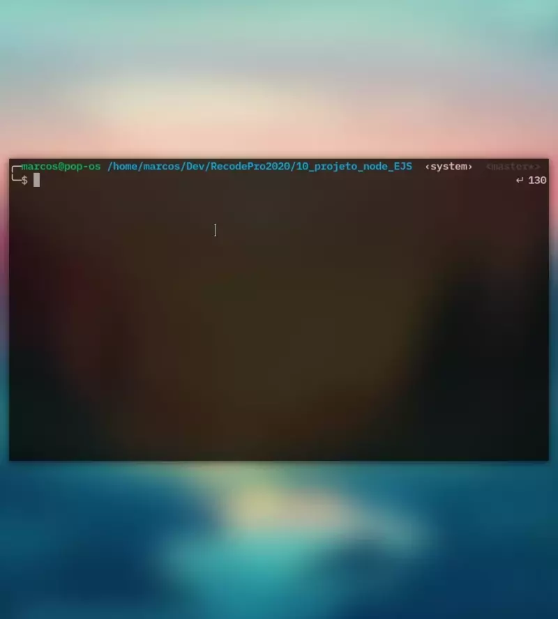

# Projeto NodeJs Com EJS

- Mais um de NodeJs
  - Desta vez, o objetivo era um form com pelo menos 2 campos
  - E uma página de retorno dos dados processados
  - Eu decidi usar a API do [Vagalume Letras](https://api.vagalume.com.br/)
  - Vale dizer que essa API é muito legal e contém muitos dados interesantes.
  - Todo o projeto foi feito em Node e MVC(eu acho, rs)
  - Módulos usados: Express, EJS, Node-Fetch e Body-Parser e Nodemon em desenvolvimento.

  ### Projeto entregue | 28/01/21

  ### Demonstração ↓
  