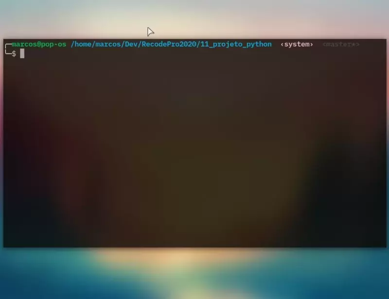

# Projeto Python com Flask

Rápida passagem do Python no curso da Recode
  - A brincadeira aqui era fazer um servidor com:
    - Um form para pegar valores
    - Uma Api recebendo os dados e calculando algo
    - E renderizar ou resultado
    - Então criei uma simples calculadora IMC
  - Para rodar o projeto é preciso do pacote Flask 'pip install flask'

### Projeto entregue | 29/01/21

### Demonstração ↓
  