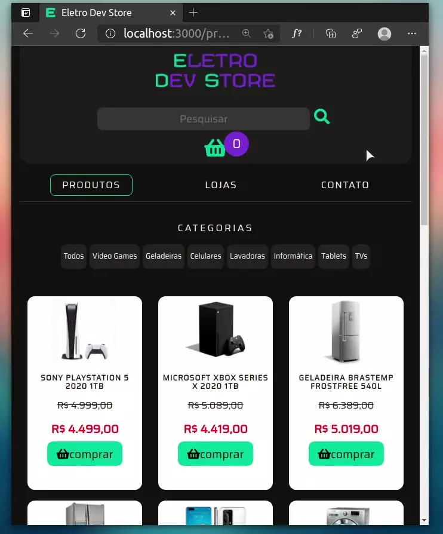

# Projeto React com Redux

A volta dos que não foram
  - React não tem sido muito fácil rs
  - Mas... dessa vez o objetivo era adicionar Redux ao projeto React
    - Então eu decidi implantar no carrinho que ja existia, porém não era funcional
    - Agora ele recebe os produtos quando se clica em comprar
    - É possível adicionar ou remover produtos do próprio carrinho
    - Limpar todo o carrinho de uma só vez

### Projeto entregue | 01/02/21

### Demonstração ↓
  