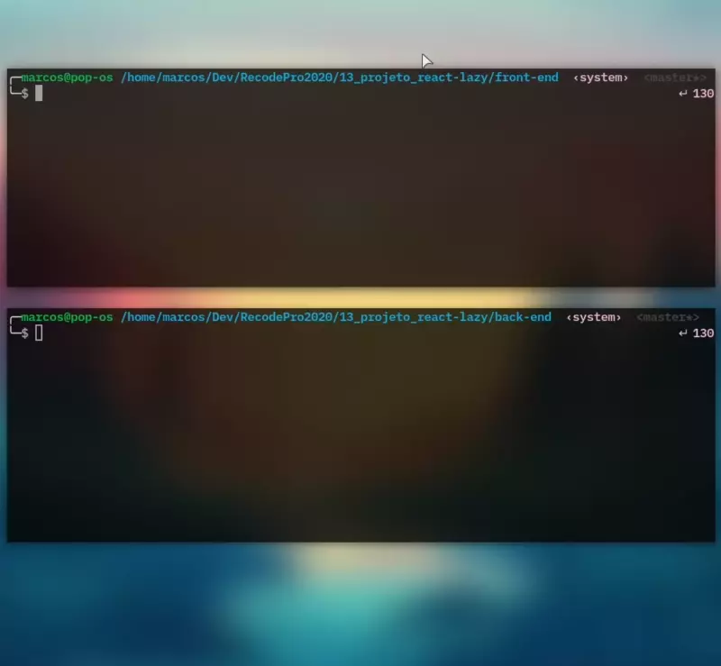

# Projeto React com Lazy Loading e banco de dados com MongoDB

Mais React
  - Agora com carregamento sobre demanda com Lazy Loading
  - E banco de dados em NoSQL com MongoDB
    - Aqui, os produtos são carregados do servidor Node
    - No projeto React com Redux os dados vinham de uma api interna no próprio React
    - O Redux continua nesse projeto, mas dessa vez fazendo Fetch com Redux Thunk vindo do Redux Toolkit!

### Projeto entregue | 12/02/21

### Demonstração ↓
  